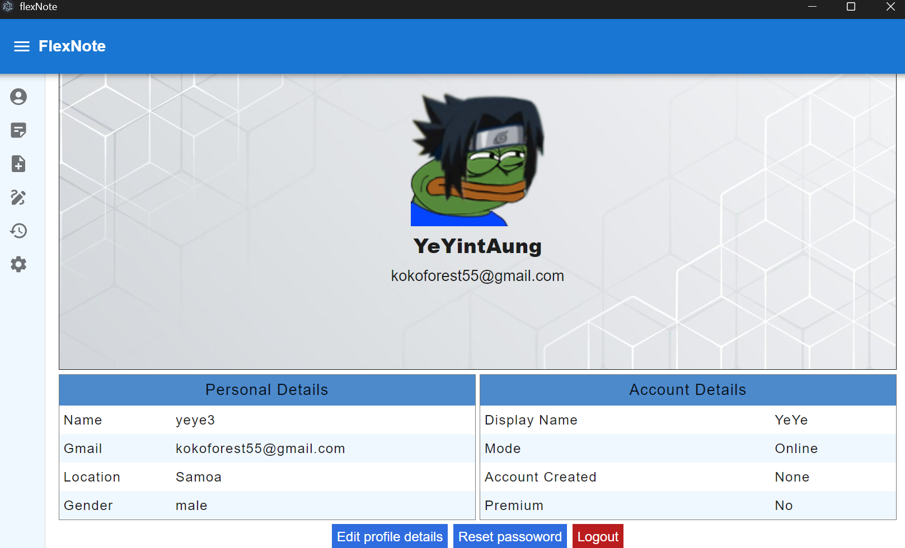
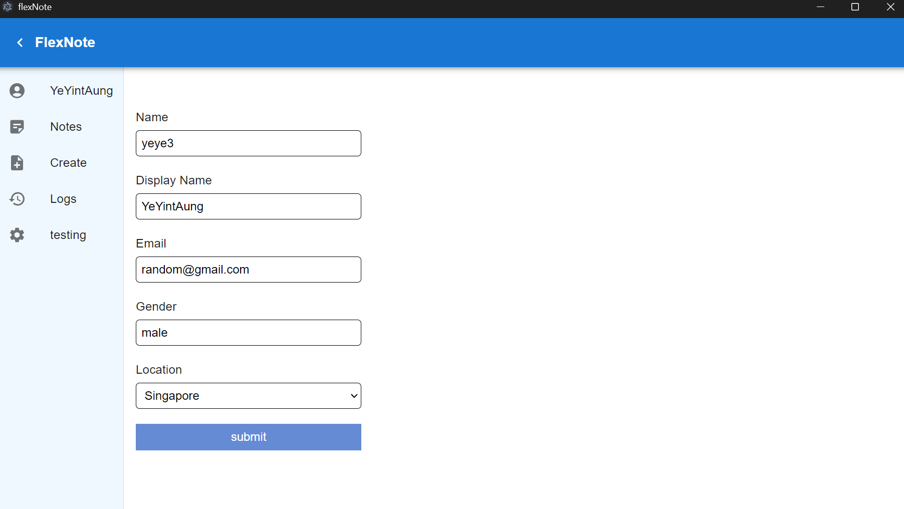
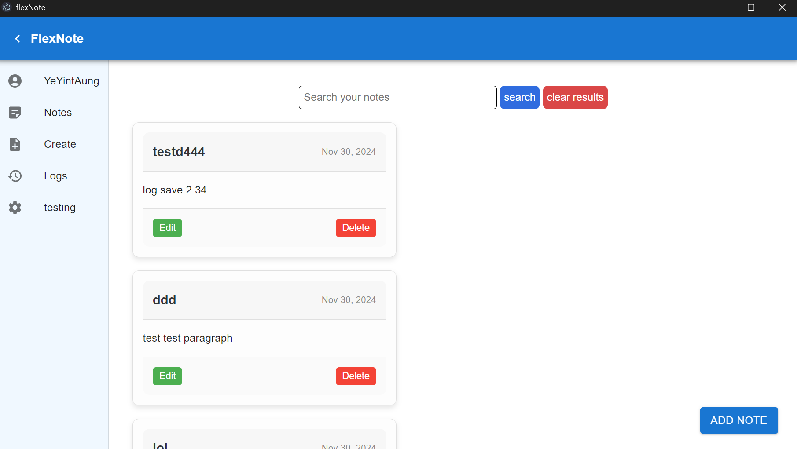
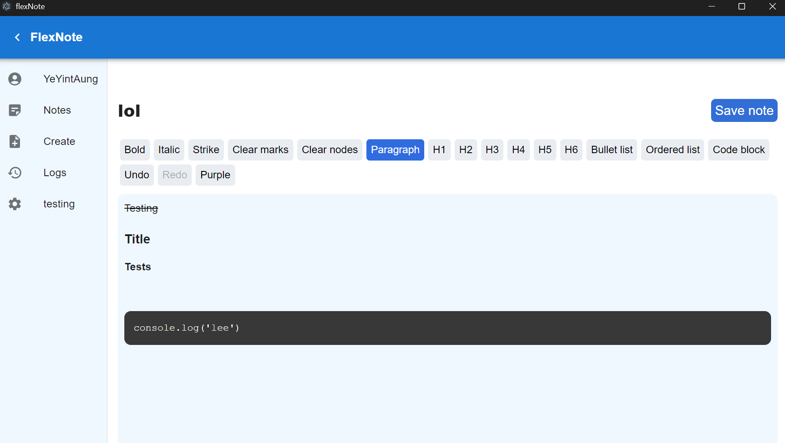
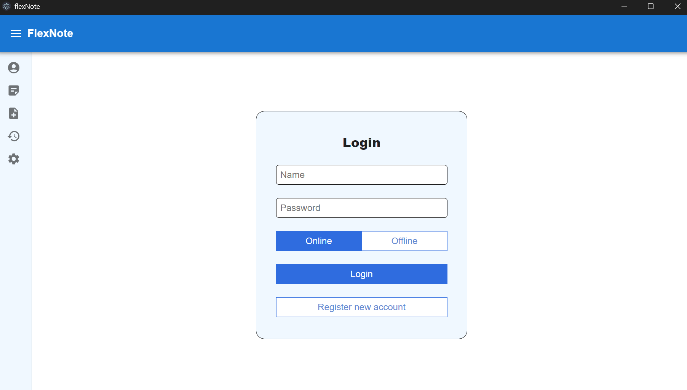
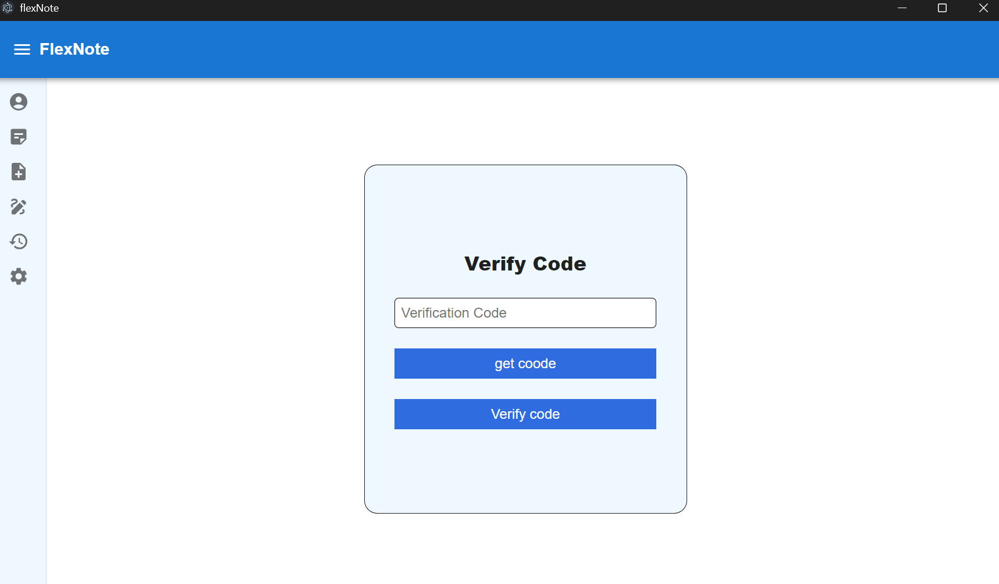
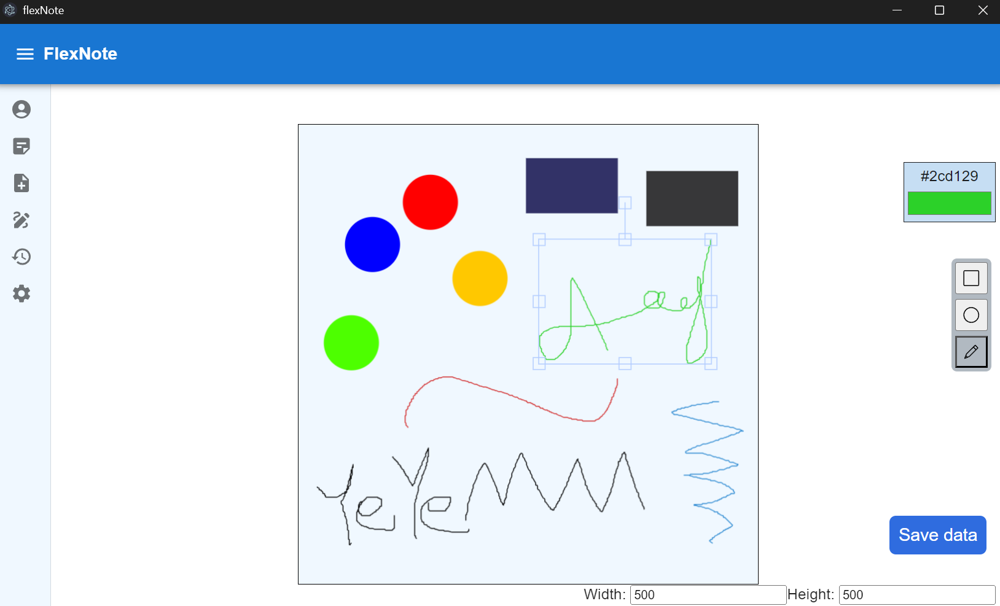

# **FlexNote** 📝  
**A powerful and flexible note-taking application with online & offline support, a drawing board, image storage, and structured code snippets.**  


## **📌 Features**  
- **Online & Offline Mode**: Support both Online and Offline mode.
- **Rich Text Editor Support**: Write notes using various text formatting.
- **Drawing Board**: Create and edit drawings with shapes and freehand tools.  
- **Image & File Uploads**: Store and retrieve images using Cloudinary.  
- **Secure Authentication**: JWT-based authentication with email verification.  
- **Multi-Device Syncing**: Seamlessly sync notes across devices.  
- **Global Search**: Quickly find notes using full-text search.  

---

## **🚀 Tech Stack**  

### **Frontend**  
- **React (Vite)** – UI development  
- **ElectronJS** – Desktop Application frameword
- **Fabric.js** – Drawing board integration  
- **axios** – Streamline network request 
- **Material UI** – UI components 
- **tiptap** – Text Editor
- **Cloudinary** – Image storage  
- **luxon** – Data and Time management
- **HTML & SASS** – Styling

### **Backend**  
- **Node.js (Express.js)** – Server & API for online mode 
- **Electron IpcMain** – Handle requests for offline mode  
- **SQLite** – For both Online and Offline database 
- **JWT** – Authentication token for online mode
- **express-rate-limit** - Setting requests limit for API
- **bcrypt.js** - Hashing password
- **crypto** - Generating session token for offline mode
- **Resend (Email API)** – Email verification API for password reset  

---

## **📸 Screenshots** 

- ### Profile page


---

- ### Edit profile image


---

- ### Notes preview 


---

- ### Notes editor 


---

- ### Authentication page 


---

- ### Verifying code for password reset


---

- ### Drawing board 



---

## API Endpoints

### Authentication

| Method | Endpoint           | Description                  | 
|--------|-------------------|------------------------------|
| POST   | `/api/auth/register` | Register a new user          |
| POST   | `/api/auth/login` | Log in and generate jwt token               |
| POST   | `/api/auth/logout` | Log out the current user     | 
| GET   | `/api/auth/verifyToken` | Verify or Refresh JWT token        | 


### Password reset

| Method | Endpoint            | Description                  | 
|--------|--------------------|------------------------------|
| post    | `/api/users/:id/generateCode`   | Generate vefification code and send email |
| PUT    | `/api/users/:id/verifyCode` | Verify code    | 
| PUT | `/users/:id/resetPassword` | Reset password   | 


### User Management

| Method | Endpoint            | Description                  | 
|--------|--------------------|------------------------------|
| GET    | `/api/auth/verifyToken`   | Verify token and get current user profile  |
| PUT    | `/api//users/:id` | Update user profile    | 
| GET | `/generateSignature` | Authenticate to upload image   |
| GET | `/api//users/:id/profileImage` | Update user image   |
 

### Notes Management

| Method | Endpoint           | Description                  | 
|--------|-------------------|------------------------------|
| GET    | `/api/notes`      | Fetch all notes              | 
| POST    | `/api/notes/`  | Added new note        |
| PUT    | `/api/notes/:id`  | Update a note                | 
|PUT    | `/api/notes/:id/name`  | Update note name       | 
| DELETE | `/api/notes/:id`  | Delete a note                | 


### Drawing Board

| Method | Endpoint             | Description                    | 
|--------|---------------------|--------------------------------|
| GET    | `/api/drawingBoard`      | Fetch drawing boad data             |
| POST    | `/api/drawingBoard`  | Create drawing new drawing board      | 
| PUT   | `/api/drawingBoard`   | Edit drawing board|
| DELETE | `/api/drawingBoard`  | Delete drawing board  |

### Logs & Activity

| Method | Endpoint       | Description                        | 
|--------|--------------|------------------------------------|
| GET    | `/api/users/:id/history`  | Fetch user activity logs          | 
| POST | `/api/users/:id/history`  | Create activity log  |


## Configuration  
**Creating `.env` file for backend**  
```env
CLOUDINARY_CLOUD_NAME = "YOUR_CLOUDINARY_CLOUD_NAME"
CLOUDINARY_API_KEY = "YOUR_CLOUDINARY_API_KEY"
CLOUDINARY_API_SECRET = "YOUR_CLOUDINARY_API_SECRET"
RESEND_API_SECRET = "YOUR_RESEND_API_SECRET"
RESEND_EMAIL = "YOUR_RESEND_EMAIL"
MY_WEBSITE = "WEBSITE_URL"
```
---

### Future plan

- **Data migration between online and offline modes**
- **Realtime note editor data update uisng socket io**
- **Multiple drawing board support for a single user**
- **Sign in using google account**
- **Note data edit history which will allow user to roll back to previous version**

